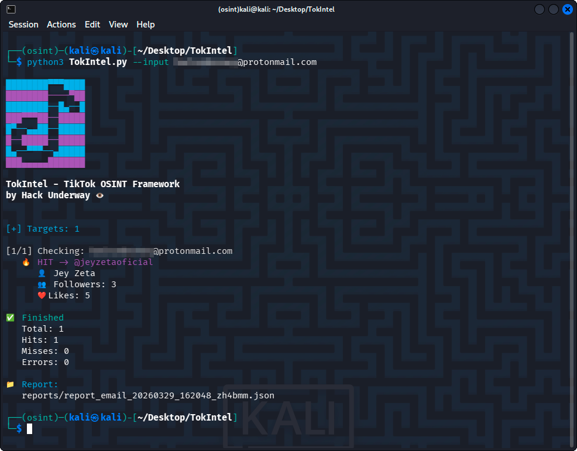
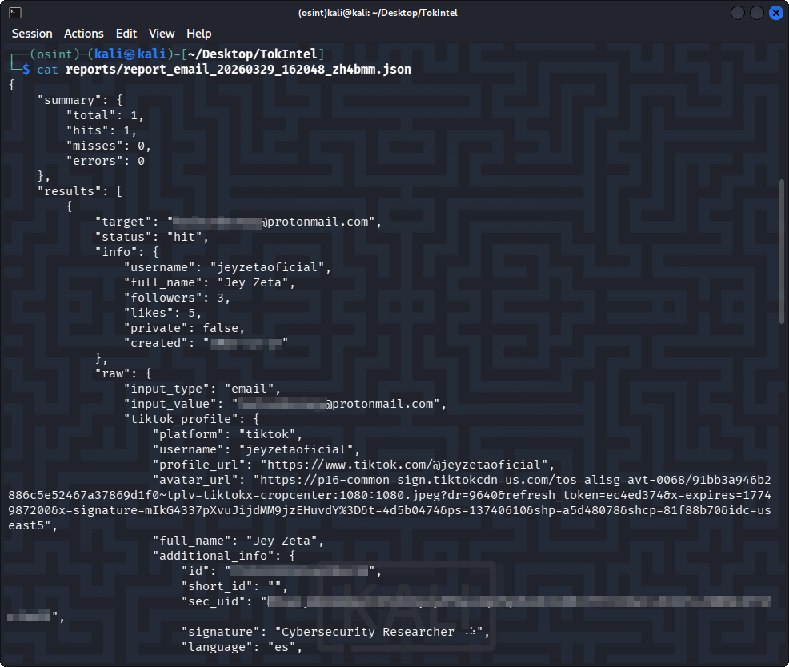
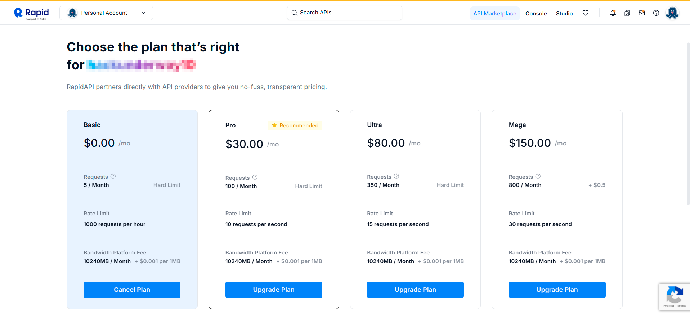
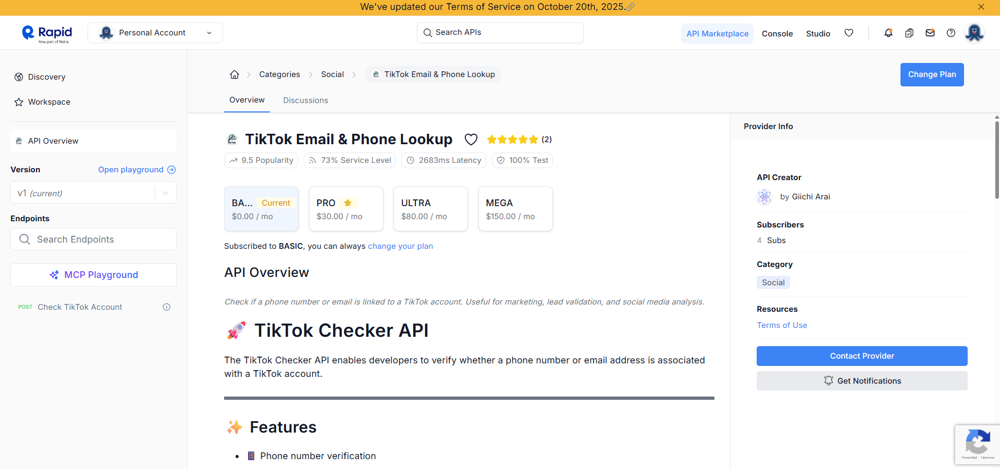
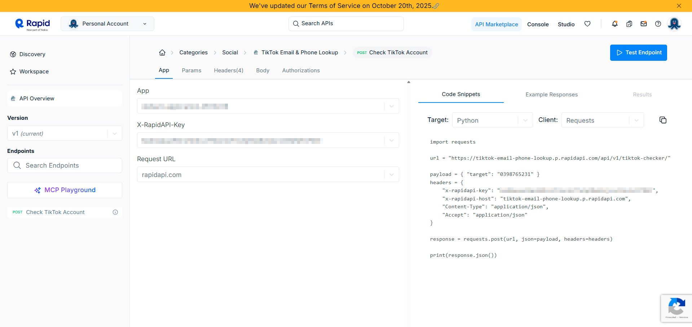
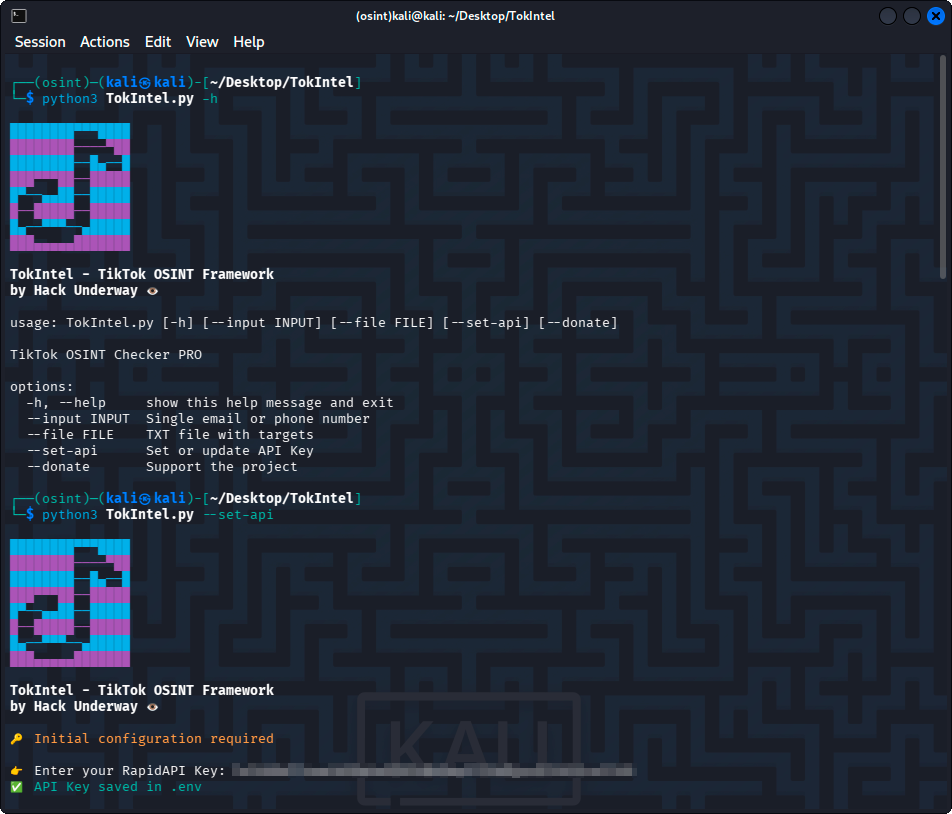
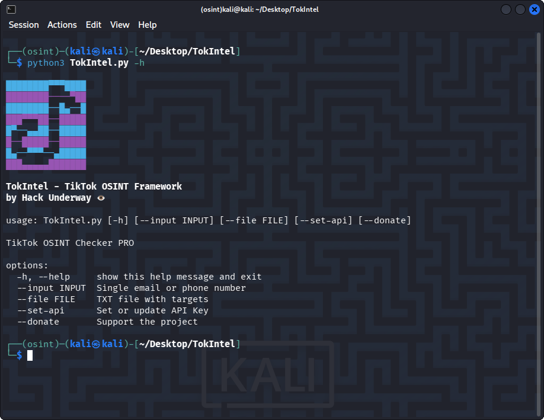

<h1 align="center">TokIntel 👁</h1>

<p align="center">
  <strong>Advanced TikTok OSINT Framework</strong> to find accounts by email or phone and extract bios, creation dates, and full profile data 🕵🏽‍♂️
</p>

<p align="center">
  
</p>

<p align="center">
  
</p>

<p align="center">
  
  
  
</p>

---

## 🚀 Features

- 🔎 **Deep Reconnaissance:** Email & phone number lookup.
- 📊 **Rich Metadata Extraction:** Recovers creation dates, bios, full metrics, and high-res avatars.
- ⚡ **Fast API-Based Checking:** Powered by rapid external data sources.
- 📄 **JSON Report Generation:** Automatically saves all structured results locally.
- 🎨 **Colored CLI Interface:** Clean, aesthetic, and professional terminal output.
- 🔐 **Secure API Key Handling:** Credentials strictly managed via `.env`.
- 📂 **Batch Processing:** Scan lists of targets via TXT file.
- 💡 **Automatic API Setup:** Interactive onboarding on the first run.

## 📌 Prerequisites

- Python 3.8+

- Librerías: `requests`, `python-dotenv`, `colorama`

# 🔑 API Key (RapidAPI)

TokIntel uses the following API:

NOMBRE | KEY |
| ------------------- |-------------- |
| [TikTok Checker API](https://rapidapi.com/araigiichikl7lc1/api/tiktok-email-phone-lookup) |  🔑 (Required) |

### Steps:
1. Go to RapidAPI
2. Subscribe to the **free plan**
3. Copy your API Key

<p align="center">
  
</p>

<p align="center">
  
</p>

<p align="center">
  
</p>


# ⚙️ Configuration

The first time you run the tool, it will ask for your API key:

```bash
python3 TokIntel.py
```

Your key will be automatically saved in:

.env

You can update it anytime:

```bash
python3 TokIntel.py --set-api
```

<p align="center">
  
</p>
---

# 💻 Usage

### 🔹 Single target
```bash
python3 TokIntel.py --input example@gmail.com
```
```bash
python3 TokIntel.py --input +519XXXXXXXX
```

<p align="center">
  
</p>

---

### 🔹 Multiple targets
```bash
python3 TokIntel.py --file targets.txt
```
---

### 💖 Support
```bash
python3 TokIntel.py --donate
```
---

# 📁 Reports

All results are saved in the `/reports/` directory.

Example file:
`report_email_20260328_xxxxxx.json`

> [!TIP]
> **Note:** Check the generated JSON report for advanced profile metadata not displayed in the terminal.

---

# 📦 Installation

```bash
git clone https://github.com/HackUnderway/TokIntel.git
```
```bash
cd TokIntel
```
```bash
pip install -r requirements.txt
```

> [!WARNING]
> ## Disclaimer
> This tool is intended for **educational and OSINT research purposes only**.
> - Do not use for illegal activities.
> - The developer is not responsible for any misuse or damage caused by this tool.

---

# 🧠 Notes

- Phone lookups may be unreliable due to API limitations
- Results depend on external data sources
- A "MISS" does not guarantee the account does not exist

> **The project is open to collaborators and partners.**

# 🧪 Supported Systems
|Distribution | Verified version | 	Supported | 	Status |
|--------------|--------------------|------|-------|
|Kali Linux| 2026.1| ✅| Working   |
|Parrot Security OS| 6.3| ✅ | Working   |
|Windows| 11 | ✅ | Working   |
|BackBox| 9 | ✅ | Working   |
|Arch Linux| 2024.12.01 | ✅ | Working   |

# Support
For questions, bug reports, or suggestions, please contact: info@hackunderway.com

# License
- [x] TokIntel is licensed.
- [x] See the [LICENSE](https://github.com/HackUnderway/TokIntel#MIT-1-ov-file) file for more information.

# 👨‍💻 Author

* [Victor Bancayan](https://www.offsec.com/bug-bounty-program/) - (**CEO at [Hack Underway](https://hackunderway.com/)**) 

## 🔗 Links
[](https://www.patreon.com/c/HackUnderway)
[](https://hackunderway.com)
[](https://www.facebook.com/HackUnderway)
[](https://www.youtube.com/@JeyZetaOficial)
[](https://x.com/JeyZetaOficial)
[](https://instagram.com/hackunderway)
[](https://tryhackme.com/p/JeyZeta)

## ☕️ Support the project

If you like this tool, consider buying me a coffee:

[](https://www.buymeacoffee.com/hackunderway)

## 🌞 Subscriptions

###### Subscribe to: [Jey Zeta](https://www.facebook.com/JeyZetaOficial/subscribe/)

[](https://www.kali.org/)

from  made in  with  by: <font color="red">Victor Bancayan</font>

© 2026