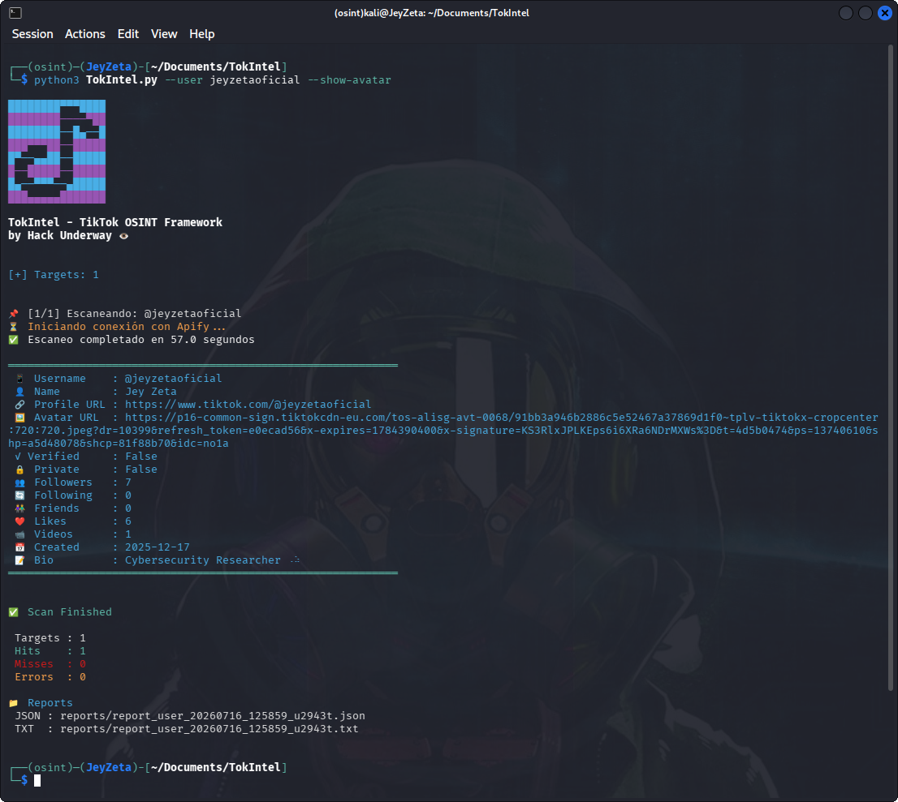
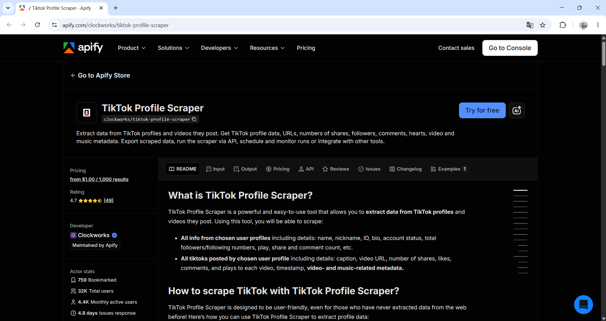
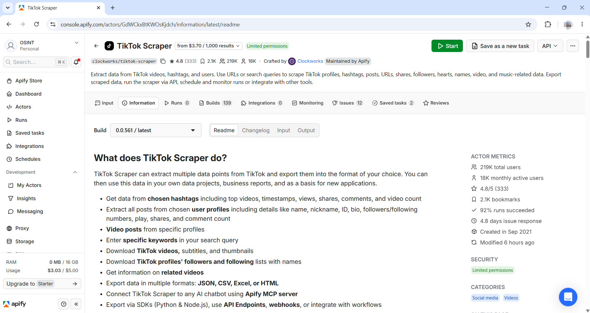
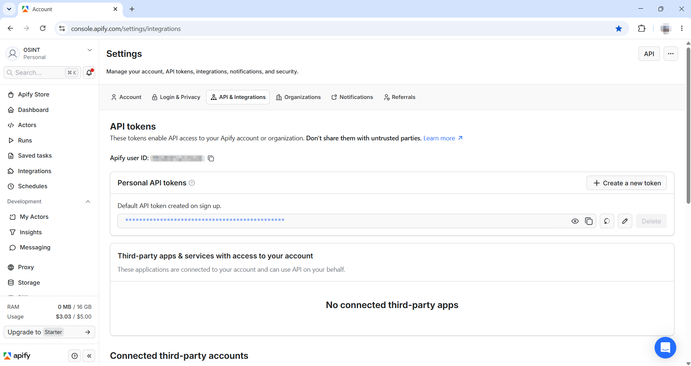
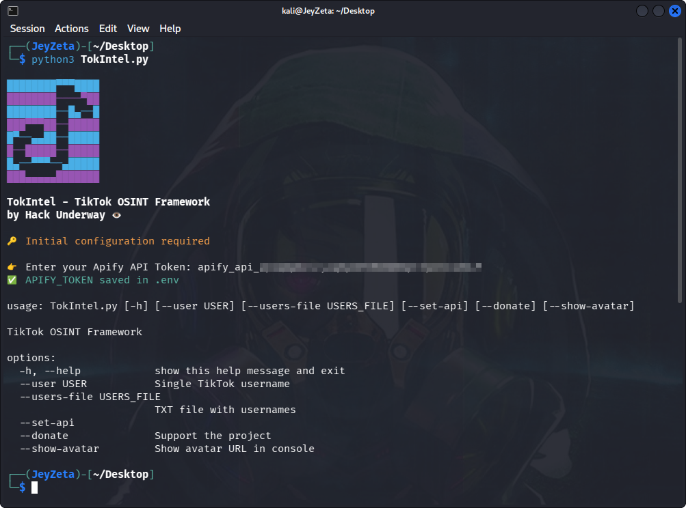
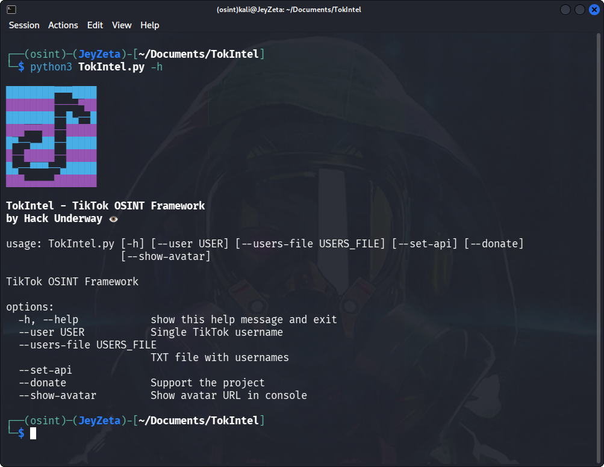

<h1 align="center">TokIntel 👁</h1>

<p align="center">
  <strong>Advanced TikTok OSINT Framework</strong> to extract profiles, bios, creation dates, and full metadata from TikTok usernames 🕵🏽‍♂️
</p>

<p align="center">
  
</p>

<p align="center">
  
  
  
</p>

---

## 🚀 Features

- 🔎 **Profile Reconnaissance:** Extracts full TikTok profile data from usernames.
- 📊 **Rich Metadata Extraction:** Recovers creation dates, bios, full metrics (followers, likes, videos, friends, etc.), and high-res avatars.
- ⚡ **Fast API-Based Checking:** Powered by Apify's TikTok Profile Scraper.
- 📄 **JSON and TXT Report Generation:** Automatically saves all structured results locally.
- 🎨 **Colored CLI Interface:** Clean, aesthetic, and professional terminal output.
- 🔐 **Secure API Key Handling:** Credentials strictly managed via `.env`.
- 📂 **Batch Processing:** Scan lists of targets via TXT file.
- 💡 **Automatic API Setup:** Interactive onboarding on the first run.

## 📌 Prerequisites

- Python 3.8+
- Dependencies: `apify-client`, `python-dotenv`, `colorama`, `alive-progress`

# 🔑 API Key (Apify)

TokIntel uses the following API:

| NAME | KEY |
| ---- | --- |
| [TikTok Profile Scraper](https://apify.com/clockworks/tiktok-profile-scraper) | 🔑 (Required) |

### Steps:
1. Go to [Apify](https://apify.com) and create a free account.
2. Get your **API Token** from your Apify account settings.
3. Copy your API Token.

<p align="center">
  
</p>

<p align="center">
  
</p>

<p align="center">
  
</p>


# ⚙️ Configuration

The first time you run the tool, it will ask for your API key:

```bash
python3 TokIntel.py
```

Your key will be automatically saved in:

.env

<p align="center">
  
</p>

You can update it anytime:

```bash
python3 TokIntel.py --set-api
```

---

# 💻 Usage

### 🔹 Single target
```bash
python3 TokIntel.py --user jeyzetaoficial
```
```bash
python3 TokIntel.py --user jeyzetaoficial --show-avatar
```
```bash
python3 TokIntel.py --users-file targets.txt
```
`targets.txt should contain one username per line (without @).`
```bash
python3 TokIntel.py -h
```

<p align="center">
  
</p>

---

# 📁 Reports

All results are saved in the `/reports/` directory.

Example file:
`report_email_20260328_xxxxxx.json`

> [!TIP]
> **Note:** Check the generated JSON report for advanced profile metadata not displayed in the terminal.

---

# 📦 Installation

```bash
git clone https://github.com/HackUnderway/TokIntel.git
```
```bash
cd TokIntel
```
```bash
pip install -r requirements.txt
```

> [!WARNING]
> ## Disclaimer
> This tool is intended for **educational and OSINT research purposes only**.
> - Do not use for illegal activities.
> - The developer is not responsible for any misuse or damage caused by this tool.

---

# 🧠 Notes

- Phone lookups may be unreliable due to API limitations
- Results depend on external data sources
- A "MISS" does not guarantee the account does not exist

> **The project is open to collaborators and partners.**

# 🧪 Supported Systems
|Distribution | Verified version | 	Supported | 	Status |
|--------------|--------------------|------|-------|
|Kali Linux| 2026.1| ✅| Working   |
|Parrot Security OS| 6.3| ✅ | Working   |
|Windows| 11 | ✅ | Working   |
|BackBox| 9 | ✅ | Working   |
|Arch Linux| 2024.12.01 | ✅ | Working   |

# Support
For questions, bug reports, or suggestions, please contact: info@hackunderway.com

# License
- [x] TokIntel is licensed.
- [x] See the [LICENSE](https://github.com/HackUnderway/TokIntel#MIT-1-ov-file) file for more information.

# 👨‍💻 Author

* [Victor Bancayan](https://www.offsec.com/bug-bounty-program/) - (**CEO at [Hack Underway](https://hackunderway.com/)**) 

## 🔗 Links
[](https://www.patreon.com/c/HackUnderway)
[](https://hackunderway.com)
[](https://www.facebook.com/HackUnderway)
[](https://www.youtube.com/@JeyZetaOficial)
[](https://x.com/JeyZetaOficial)
[](https://instagram.com/hackunderway)
[](https://tryhackme.com/p/JeyZeta)
[](https://ko-fi.com/hackunderway)
[](https://profile.hackthebox.com/profile/019d59e8-fcc1-72e9-9aad-ff79f46d261d)

### 💰 Bitcoin Donations
Support the project with Bitcoin:

### Address:
```bash
bc1qjd5pu8kmdq1jun3qyw5e9mj4kdef9n8sutj7j4
```

<p align="center">  </p>
Thank you for your support! 🙏

## ☕️ Support the project

If you like this tool, consider buying me a coffee:

[](https://www.buymeacoffee.com/hackunderway)

## 🌞 Subscriptions

###### Subscribe to: [Jey Zeta](https://www.facebook.com/JeyZetaOficial/subscribe/)

[](https://www.kali.org/)

from  Peru, made in  with  by: Victor Bancayan

© 2026
